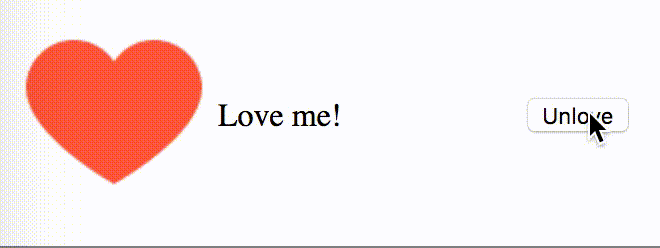

# react-example-001
_Simple example of using parent components to communicate between sibling components_

---

The webpack build process follows [this tutorial](https://www.andrewhfarmer.com/build-your-own-starter/#0-intro)

The app is based on [this one](http://react.tips/how-reactjs-components-communicate/)

### Setup
* `npm install`

### Compile
* `npm run compile`
