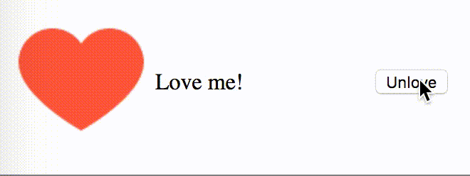

# react-example-001
_Simple example of using parent components to communicate between sibling components_

---



Currently written with ES5. [Here's a resource](https://reactjs.org/docs/react-without-es6.html) for those of us that don't speak that anymore :sweat_smile:

```
.
├── .babelrc
├── .gitignore
├── README.md
├── build
│   ├── app.js
│   └── index.html
├── package.json
├── source
│   ├── app.jsx
│   ├── components
│   │   ├── Button.jsx
│   │   ├── HeartIcon.jsx
│   │   ├── Message.jsx
│   │   └── Relationship.jsx
│   └── images
│       ├── demo.gif
│       ├── loved.png
│       └── not-loved.png
└── webpack.config.js
```
| File/Directory         | Description |
| ---------------------: | :---------- |
| `build/`               | home of `index.html` and where `webpack` dumps it's compiled `.jsx` |
| `package.json`         | `npm` config file for managing dependencies and running commands |
| `source/`              | place for `react` components and other assets |
| `webpack.config.json`  | config for managing the build process |

The webpack build process follows [this tutorial](https://www.andrewhfarmer.com/build-your-own-starter/#0-intro)

The app is based on [this one](http://react.tips/how-reactjs-components-communicate/)


### Setup
* `npm install`

### Compile
* `npm run compile`

### TODO
* add dev server
* modernize with ES7
